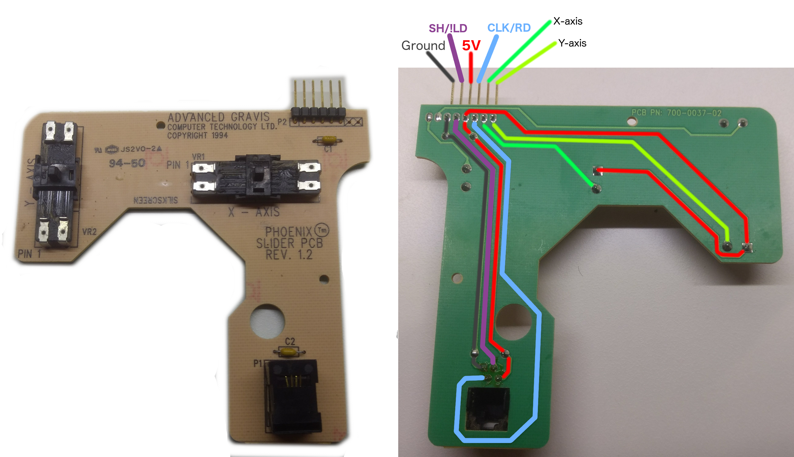

# phoenix-arduino

Convert a Gravis Phoenix Joystick to USB using an Arduino

The Gravis Phoenix is a 4-axis programmable Joystick with 24 buttons. Up to 4 buttons could be programmed to behave as standard joystick buttons, while the remainder could behave as if a key was pressed on the keyboard. To accomplish this, the joystick connected via both the 15 pin joystick port and a AT or PS/2 keyboard passthrough.


It's no longer practical to use this joystick with modern computers due to the lack of a joystick port. Even USB joystick adapters do not make it possible to use the DOS boot disk configuration utility in order to reprogram the buttons.

This project will investigate removing the main logic board of the phoenix and replacing it with an Arduino which will also act as a USB input device. The initial focus will be on understanding the Phoenix's circuitry in order to make the proper connections and readings with the Arduino. To do this, I disassembled the joystick in order to investigate its components.

## Components


The Phoenix contains 5 Printed Circuit Boards (PCBs)
1. Micro PCB: Connects to the computer via joystick and keyboard connectors. Also connects to the Slider PCB via 6 pins and Wing PCB via 10 pins. This is the part we will remove and replace with an Arduino to modernize the joystick.

2. Slider PCB: Contains 2 potentiometers (X and Y axes) and a RJ11 connector which connects to the Handle PCB.


3. Handle PCB: Contains 8 buttons and connects to the Slider PCB via a RJ11 cable. Uses a HC165 8-bit parallel load shift register to make 8 button states available over the 4 wire connection.


4. Wing PCB: Contains 8 buttons and 2 potentiometers to read the throttle and rudder axes. Connects to the Throttle PCB via a 4 wire ribbon cable. Uses a HC165 8-bit parallel load shift register to allow the Micro PCB to read the button states.


5. Throttle PCB: Contains 8 buttons. I did not this component to map out the traces, since it's essentially the same as the Handle PCB with a different layout. It includes another HC165 8-bit parallel load shift register. I tested both combinations of SH/!LD and CLK/RD pins in order to label the connections to the Throttle PCB on the Wing PCB.


## HC165

Since the Phoenix uses 3 HC165 chips, it will be important to understand how it operates. The [SN74HC165 Data Sheet](images/SN74HC165.pdf) shows the pinout and describes the operation. There is also an [HC165 Arduino code sample](https://playground.arduino.cc/Code/ShiftRegSN74HC165N) which is available for experimentation. However, note in the Handle PCB that the CLK and Q_H(read) pins are actually connected to the same wire. Presumably this is a cost saving measure.

Briefly setting the SH/!LD pin LOW will cause the HC165 to load 8 bits in parallel from pins A-H. When SH/!LD is set HIGH, values on A-H is ignored and the value from H is immediately available on Q_H. At this point, each LOW to HIGH transition on CLK/Q_H is seen by the CLK pin and causes the HC165 to make the next data bit available (G,F,...). If the button is not pressed, the signal will remain HIGH. If the button is pressed, the voltage will be forced LOW, which is ok since it won't be interpreted as a clock transition. Here is a sample oscilloscope trace of the CLK/READ wire of the Handle/Slider PCBs while connected to the Micro PCB and powered via the joystick port. In this case the 5th button was pressed, showing substantially longer LOW voltage during that time.


I used a Hantek HT6022BE Oscilloscope with the [OpenHantek Software](https://github.com/OpenHantek/openhantek) in order to collect the above traces. The oscilloscope is available for $65-70 USD and is an excellent troubleshooting tool.

## Prototyping with an Arduino Nano

The [Arduino Nano](https://store.arduino.cc/usa/arduino-nano) is a small device which should fit inside the Phoenix with plenty of clearance. Despite its small size, it uses an ATmega328P and exposes 8 analog inputs and 12 digital pins. Mine is a clone which enumerates with USB VID:1A86 PID:7523, identifying it as a CH340 uart. This requires a [driver from the manufacturer's website](http://www.wch.cn/download/CH341SER_EXE.html) in order to use the serial monitor in the Arduino IDE.

The image below shows how the nano is wired to work with the [phoenix-arduino-test.ino](examples/phoenix-arduino-test/phoenix-arduino-test.ino) test program.


As long as no buttons are pressed, phoenix-arduino-test.ino continuously dumps the state of the potentiometers for each axis:
```
axes: X: adc:548 res:87 out:127 clmp:127
      Y: adc:553 res:85 out:127 clmp:127
      R: adc:697 res:47 out:63 clmp:63
      T: adc:702 res:46 out:63 clmp:63
```
* adc: 0-1023 reading from the Analog to Digital Converter
* res: resistance computed using Ohm's law from the ADC reading and the
  reference resistance. In the image above, note the reference resistors to the
  left of the Arduino near the analog input pins.
* out: resistance mapped linearly to a specified output range, currently set to
  0-127 for each potentiometer
* clmp: the output value clamped to the output range, to ensure it is within
  spec

Each time one of the buttons' state changes, the test program dumps the button
state. Below is sample output when the trigger and one of the wing buttons are
pressed.
```
 group 01234567
handle .....0..
  wing .......0
thrttl ........
```

## Arduino Micro with Native HID Support

The [Arduino Micro](https://store.arduino.cc/usa/arduino-micro) is based on the
ATmega32U4 which has integrated USB support. Many other Arduinos rely on an
external chip for USB communication, which requires flashing software onto both
chips and communicating between them in order to implement a USB device such as
a joystick. However, the Arduino Micro is able to use the built-in
[HID](https://www.arduino.cc/en/Reference/HID) library in order to add a
descriptor for your USB HID device and report events. The
[Mouse](https://github.com/arduino-libraries/Mouse/blob/master/src/Mouse.cpp)
library is a convenient example for this functionality.

The most difficult part of creating a USB HID device is creating the descriptor.
This is a blob of binary data sent from the device to the computer describing
the device's capabilities and the format of the data that it reports. I found
many examples of descriptors which were raw hex bytes with haphazard comments
that were hard to follow. I wanted a better way to directly generate the HID
descriptor using C++ enums, so I created
[HidDescriptorHelper.h](src/HidDescriptorHelper.h) based on the
[HID 1.11](http://www.usb.org/developers/hidpage/HID1_11.pdf) and
[HID Usage Tables 1.12](http://www.usb.org/developers/hidpage/Hut1_12v2.pdf)
specifications.

Here is the beginning of a descriptor constructed using HidDescriptorHelper.h:
```C++
#include "HidDescriptorHelper.h"
using namespace usb::hid;
static const u8 sHidDescriptorData[] PROGMEM = {
  Global::UsagePage | 1, usage::Page::GenericDesktop,
  Local::Usage | 1, usage::generic_desktop::Application::Joystick,

  Main::Collection | 1, Collection::Application,
    ...
  Main::EndCollection | 0,
};
```

I strongly prefer this to the alternative which requires continuously
referencing the specifications and allows for the possibility of the data
not matching the comments.
```C++
static const u8 sHidDescriptorData[] PROGMEM = {
  0x05, 0x01, // USAGE_PAGE (Generic Desktop)
  0x09, 0x04, // USAGE (Joystick)
  0xa1, 0x01, // COLLECTION (Application)
  0xc0,       // END COLLECTION
};
```

Using [HidDescriptorHelper.h](src/HidDescriptorHelper.h), I created the example
[phoenix-arduino-joystick.ino](examples/phoenix-arduino-test/phoenix-arduino-joystick.ino)
which adds a HID descriptor for the phoenix and reports events. Since I replaced
the Nano with the Micro, I also reworked my wiring layout and made corresponding
updates to the pin mappings.


After all of these changes, I was finally able to run the new example. I saw the
joystick register with 4 axes and 24 buttons, and verified that all were
functioning correctly.


